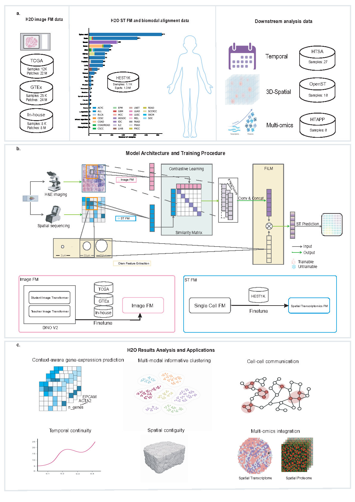

# H2O

This is the official codebase for **H2O: A Foundation Model Bridge for Virtual Spatial Multi-Omics from Histopathology

Spatial omics technologies have revolutionized the molecular profiling of tissues but remain constrained by high costs  
and limited scalability. While hematoxylin and eosin (H&E) staining is  ubiquitous, it lacks molecular specificity.  
Here, we present H2O, a generalist AI framework that bridges the modality gap between histopathology and spatial multi-omics,  
enabling the direct inference of spatial transcriptomics (ST) and proteomics (SP) landscapes from   routine H&E images.



# Dataset
## Local data path:
Our training and testing data can be find locally at:  
 &nbsp;&nbsp;&nbsp;&nbsp;/data/home/youngeegu/datasets/hest1k/hest_data/hest1k_whole/e25/hest1k_cnts_test_e25.h5  
&nbsp;&nbsp;&nbsp;&nbsp;/data/home/youngeegu/datasets/hest1k/hest_data/hest1k_whole/e25/hest1k_cnts_train_e25.h5  
The benchmark subset is at:  
&nbsp;&nbsp;&nbsp;&nbsp;/data/home/youngeegu/datasets/hest1k/hest_data/hest1k_whole/bench/bench_PRAD_nbrs.h5  
&nbsp;&nbsp;&nbsp;&nbsp;/data/home/youngeegu/datasets/hest1k/hest_data/hest1k_whole/bench/bench_ccRCC_nbrs.h5  
&nbsp;&nbsp;&nbsp;&nbsp;/data/home/youngeegu/datasets/hest1k/hest_data/hest1k_whole/bench/bench_IDCLymphNode_nbrs.h5  
The training and testing data for downstream task:  
&nbsp;&nbsp;&nbsp;&nbsp;/data/home/youngeegu/datasets/HSTA/HTSA.h5  
&nbsp;&nbsp;&nbsp;&nbsp;/data/home/youngeegu/datasets/htapp/HTAPP_codex_128_binned.h5  
&nbsp;&nbsp;&nbsp;&nbsp;/data/home/youngeegu/datasets/openst/create_patches_3d/openst.h5  
&nbsp;&nbsp;&nbsp;&nbsp;

## Online data path:
The raw data can be download from the following link:  
**HEST-1K: https://huggingface.co/datasets/MahmoodLab/hest  
**OpenST: https://rajewsky-lab.github.io/openst/latest/examples/datasets/  
**HTSA: https://cellxgene.cziscience.com/collections/fc19ae6c-d7c1-4dce-b703-62c5d52061b4  
**HTAPP:  
&nbsp;&nbsp;&nbsp;&nbsp;The preprocessed expression data can be downloaded at:  
&nbsp;&nbsp;&nbsp;&nbsp;&nbsp;&nbsp;&nbsp;&nbsp;https://singlecell.broadinstitute.org/single_cell/study/SCP2702/htapp-mbc  
&nbsp;&nbsp;&nbsp;&nbsp;Other raw material can be discovered in the HTAN portal:  
&nbsp;&nbsp;&nbsp;&nbsp;&nbsp;&nbsp;&nbsp;&nbsp;https://humantumoratlas.org/  

# Pre-trained model 
Pre-trained checkpoints can be find here:  
&nbsp;&nbsp;&nbsp;&nbsp;/data/home/youngeegu/projects/H2O/code/example/best_epoch.pth  

## 1. Environment preparation
The environment for H2O can be obtained through installing the dependencies with requirement.txt.
### Installing Guide: Utilize conda to create and activate a environment.
```bash
$ conda create H2O
$ conda activate performer
```

Install the necessary dependencies
```bash
$ conda install requirements.txt
```

# Running example:
We prepared a running case to load and predict spatial transcritpomics expression of sample   TENX92:  
&nbsp;&nbsp;&nbsp;&nbsp;/data/home/youngeegu/projects/H2O/code/example  

## Running instruction
run:  

```bash
$ cd H2O/code
$ ./H2O_run.sh
```
### Parameter in H2O_run.sh
```bash
$ cd /jizhi/jizhi2/worker/trainer/youngeegu/projects/H2O/code # YOUR_H2O_PATH/code
# Using DDP with 4 GPUs
$ CUDA_VISIBLE_DEVICES=0,1,2,3  nohup   python -m torch.distributed.run  --nproc_per_node=4   \ 
    run.py \
    --mode test \
    --debug False \
    --test_dir  ./example/TENX92.h5 \
    --model_path ./example/best_epoch.pth \
    --batch_size 80 \
    --save_dir ./results/STain_hest1k/ \
    --CLIP True \
    --nbrs True \
    --FiLM True \
    > inference.log  2>&1 &  

```

# The results will be saved in following format:  
./H2O/code/results/           # Main results folder
└── STain_hest1k/             # Project folder
    ├── summary_results_.csv               # Summary results of all samples
    ├── TENX92_best_model_coords.npy       # The coords for visualization of spatial multi-omics
    ├── TENX92_best_model_groundtruth.npy  # GT of spatial transcritpomics expression
    ├── TENX92_best_model_prediction.npy   # Prediction of spatial transcritpomics expression
    └── TENX92_best_model.csv              # Evaluation Methods for each individual gene 

# Disclaimer
This tool is for research purpose and not approved for clinical use.

This is not an official Tencent product.

# Coypright
This tool is developed in AI for Life Sciences Lab, Tencent.

The copyright holder for this project is AI for Life Sciences Lab, Tencent.

All rights reserved.
